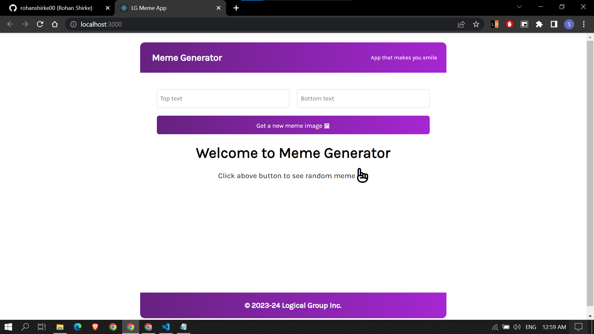
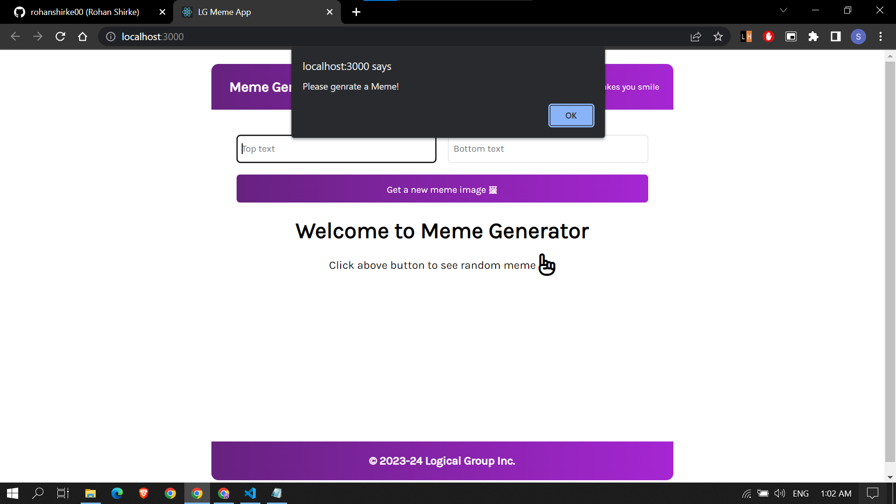
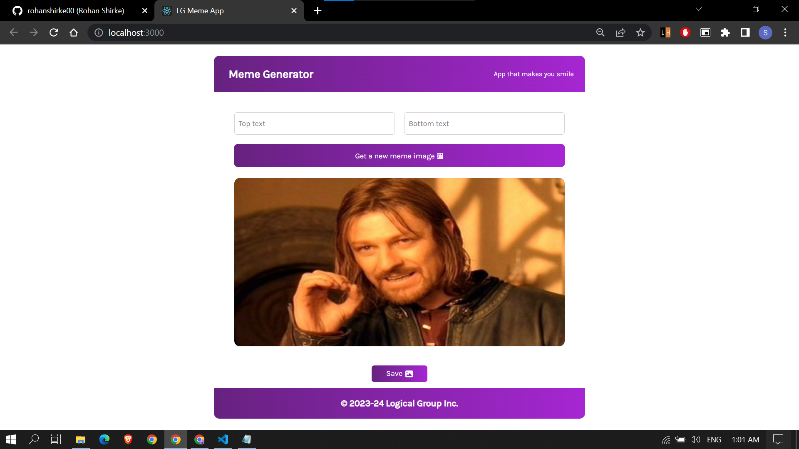
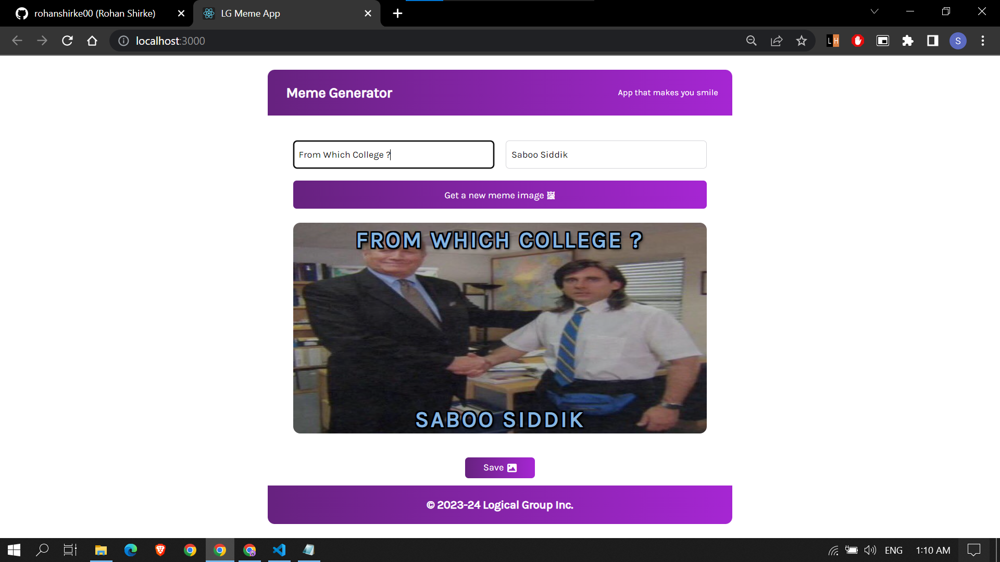

## Introduction
>  
> A simple responsive web application that makes you smile by creating the customized memes of your choice.

## Main Feature:
- Random meme
- Customize meme user can add Top & bottom caption
- Save the Meme 

## Tech Stack for Project:
>  ### Front-End:
- HTML
- CSS
- ReactJs
>  ### Back-End:
-  JavaScript 

### API Link : https://api.imgflip.com/get_memes

### Screenshots of the website

### Created by
[Rohan Shirke](https://github.com/rohanshirke00)

Email : rohanshirke2k@gmail.com

### COPYRIGHT

Copyright 2023-24 © Logical Group Inc.
All rights reserved.